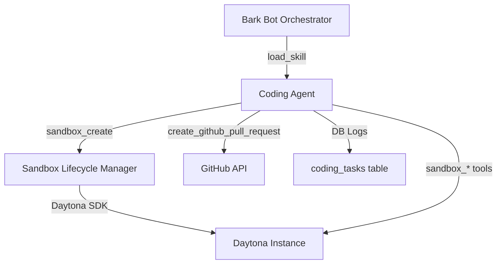

# SWE Subagent Implementation Details

Internal documentation for the BarkPack Coding Agent implementation.

---

## Architecture Overview

The SWE Subagent is implemented as a **native BarkPack skill**. It avoids the "black box" approach by using discrete tools for every operation, ensuring that all agent actions (file reads, shell commands, git operations) are observable in the session database and subject to the core `check_permissions` logic.

### Component Diagram

---

## 🛠️ Technology Stack

1.  **Orchestration**: BarkPack Agent Loop.
2.  **Sandbox**: [Daytona SDK](https://github.com/daytonaio/daytona) (`daytona-sdk`).
3.  **Database**: SQLAlchemy + Postgres + `pgvector` (for task embedding).
4.  **Language**: Python 3.13+ with `uv` package management.

---

## 📦 Implemented Tools

### Sandbox Tools (`app/tools/coding/`)
| Tool Name | Purpose | Key Parameters |
| :--- | :--- | :--- |
| `sandbox_create` | Initializes Daytona sandbox & clones repo. | `repo_url`, `branch`, `task_description` |
| `sandbox_bash` | Runs shell commands with security filters. | `command`, `workdir` |
| `sandbox_read` | Downloads/reads content of a file. | `path` |
| `sandbox_write` | Uploads/writes full file content. | `path`, `content` |
| `sandbox_edit` | Precise string replacement (safe). | `path`, `old_str`, `new_str` |
| `sandbox_glob` | Finds files via pattern matching. | `pattern`, `root` |
| `sandbox_grep` | Regex content search using `ripgrep`. | `pattern`, `path` |
| `sandbox_list` | Lists directory contents with sizes. | `path` |
| `sandbox_git_status` | Standard `git status`. | `task_id` |
| `sandbox_git_commit` | Stages and commits (Conventional format). | `message` |
| `sandbox_git_push` | Pushes branch to remote (Approval-gated). | `remote`, `branch` |
| `sandbox_test` | Auto-detects and runs test suites. | `command` (auto/manual) |
| `sandbox_diff` | Captures and logs git diff to DB. | `stat_only` |
| `sandbox_release` | Deletes the sandbox and cleans up. | `abandon` |

### GitHub Extension (`app/tools/github_tools.py`)
-   **`create_github_pull_request`**: Allows the agent to open a PR directly after pushing its work.

---

## 🗄️ Database Schema (`coding_tasks`)

The `coding_tasks` table serves as the "long-term memory" for engineering work.

-   **`task_id`**: Unique identifier (e.g., `task-abc12345`).
-   **`status`**: `running`, `awaiting_approval`, `complete`, `failed`, `abandoned`.
-   **`diff_text`**: Stores the final diff for UI display.
-   **`test_output`**: Captures results from the latest test run.
-   **`task_embedding`**: `Vector(1536)` for semantic search and deduplication.

---

## 🛡️ Security & Guardrails

### `sandbox_bash` Command Filtering
The bash tool includes a regex-based blocklist (`SENSITIVE_PATTERNS`) to prevent accidental or malicious system damage:
-   `rm -rf`
-   `git reset --hard` (on protected branches policy check is recommended)
-   `chmod 777`
-   `curl | bash` patterns
-   Database destructive commands (`DROP TABLE`, etc.)

### conventional Commits
The `sandbox_git_commit` tool enforces the **Conventional Commits** standard (`feat:`, `fix:`, `chore:`, etc.). Commits matching this pattern are verified before execution.

---

## 🤖 Agent Profile (`coding_agent.yaml`)

The Coding Agent is prompted as a **SWE Agent**:
-   **Self-Correction**: Instructed to run tests frequently and use `sandbox_diff` for review.
-   **Transparency**: Required to log thoughts via `create_agent_post` at major milestones.
-   **Isolation**: Operates strictly within `/workspace/repo` in the sandbox.

---

## 🚀 Future Roadmap (Implementation Notes)
-   **Multi-Repo Support**: Modify `sandbox_create` to allow multiple `git clone` calls into the same workspace.
-   **LSP Integration**: Add a tool to start/query a Language Server inside the container for real-time type checking.
-   **Auto-remediation**: Use `coding_tasks` history to suggest fixes for common test failures.
